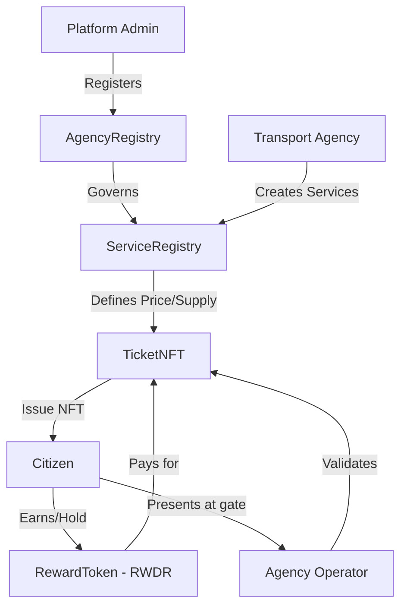

# Repay Transport Ecosystem — Technical Architecture

A blockchain-based infrastructure for managing government transport agencies, multi-modal transit services, and reward-based ticketing.

---

## System Overview

The Repay platform enables a circular economy for transport:
1.  **Users** earn `RWDR` (Reward Tokens) through verified eco-friendly actions.
2.  **Agencies** (METRO, BUS, TRAIN) are registered by a central platform administrator.
3.  **Services** are defined by agencies, mapping routes to fixed `RWDR` prices.
4.  **Tickets** are purchased as non-transferable NFTs, which are then validated (burned/used) at transit gates.

---

## Contract Architecture

---

## Key Smart Contracts

| Contract | Purpose | Governance |
|----------|---------|------------|
| **RewardToken (RWDR)** | ERC20 token used as the platform's primary currency. | Admin-controlled minting. |
| **AgencyRegistry** | Centralized directory of authorized government agencies. | Admin-only registration. |
| **ServiceRegistry**| Mapping of transit routes, pricing (in RWDR), and capacity. | Agency-controlled service mgmt. |
| **TicketNFT** | ERC721 system for issuing and validating non-transferable tickets. | Public purchase / Agency validation. |

---

## Security & Access Design

### 1. Proof of Identity (SIWE)
Authentication is strictly Web3. Users sign off-chain messages to prove wallet ownership, which establishes a JWT session.

### 2. Multi-Tier RBAC
- **ADMIN**: Can register agencies and mint RWDR tokens. Wallet address defined in server environment.
- **AGENCY**: Can create services for their own agency and validate tickets. Logic verified on-chain via `AgencyRegistry`.
- **USER**: Default role. Can view balances and purchase tickets.

### 3. Execution Guards
Critical state changes on the blockchain (like purchasing a ticket) are protected by a "Private Key Validation" pattern. The API ensures that any private key used for a transaction corresponds to the wallet address in the active, authenticated session.

### 4. Non-Transferable Tickets
To prevent black-market ticket reselling, transit NFTs are "soul-bound" — they cannot be transferred between wallets after purchase.

---

## Data Flow: Ticket Purchase

1.  **Discovery**: User queries `/service/available/:id`.
2.  **Approval**: User approves `TicketNFT` contract to spend `RWDR` via the token contract.
3.  **Purchase**: User calls `/ticket/purchase` with the `serviceId`.
4.  **Exchange**:
    - `ServiceRegistry` verifies availability.
    - `RewardToken` transfers funds from user to agency wallet.
    - `TicketNFT` mints a `VALID` NFT to the user.
5.  **Validation**: In-person, an agency operator calls `/ticket/:tokenId/validate`, marking the NFT as `USED`.